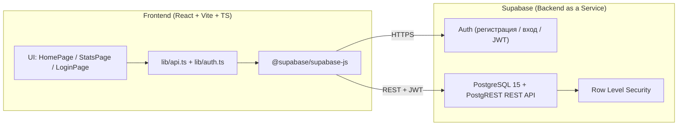

# HabitFlow — Backend и интеграция с Frontend

> Документация к ДЗ «Развертывание Backend и интеграция с Frontend».
> Стек: React + TypeScript + Vite (frontend) + Supabase (PostgreSQL + Auth + RLS + PostgREST).

## 1. Архитектура решения

Выбран **Вариант A — Supabase (BaaS)**.

**Обоснование выбора:**
- Трекер привычек — учебный проект с одним-двумя пользователями, отдельный сервер не нужен.
- Supabase даёт из коробки: PostgreSQL 15+, аутентификацию (Auth), Row Level Security (RLS)
  и автогенерируемый REST API (PostgREST) — этого достаточно для всех требований ДЗ.
- Нет необходимости поднимать VPS, Docker и следить за инфраструктурой.



## 2. Модель данных (001_init.sql)

| Таблица    | Назначение                          | Ключевые поля                |
|------------|-------------------------------------|------------------------------|
| `profiles` | Публичный профиль, 1:1 с auth.users | `id`, `email`                |
| `habits`   | Привычка пользователя               | `id`, `user_id`, `name`, `color`, `days` |
| `check_ins`| Отметка «выполнено в день»          | `id`, `habit_id`, `date_key` |

**Связи:**
- `profiles` 1:1 `auth.users` (FK `id` → `auth.users.id`, ON DELETE CASCADE).
- `habits` 1:N `check_ins` (`habit_id` → `habits.id`, ON DELETE CASCADE).

**Ограничения целостности:**
- Длина имени: `char_length(btrim(name)) between 1 and 100`.
- Формат цвета: `color ~* '^#[0-9a-f]{6}'`.
- Дни недели: `days <@ '{0,1,2,3,4,5,6}'::integer[]`, 1..7 элементов.
- Уникальность отметки: `unique (habit_id, date_key)` — одну привычку нельзя отметить дважды за день.

**Триггеры:**
- `set_updated_at()` — автообновление `updated_at` у `habits` и `profiles`.
- `handle_new_user()` — автоматическое создание строки в `profiles` при регистрации
  (SECURITY DEFINER + `set search_path = ''` для защиты).

**Индексы:**
- `idx_check_ins_date_key` — аналитика по дню.
- `idx_habits_user_created_at` — основной сценарий выборки «мои привычки, свежие сверху».

## 3. Безопасность

- **Auth:** Supabase Auth (email + пароль), подтверждение e-mail по ссылке, JWT.
  Сессия хранится в `localStorage` (`persistSession: true, autoRefreshToken: true`).
- **RLS:** включён на всех трёх таблицах (`enable row level security`).
  Политики «только свои данные» через `auth.uid()`:
  - `habits`: select/insert/update/delete — `auth.uid() = user_id`.
  - `check_ins`: все операции проверяют, что `habit_id` принадлежит текущему пользователю
    (через `exists` по `habits`).
  - `profiles`: select/update — `auth.uid() = id`; INSERT-политики нет намеренно —
    строка создаётся триггером `handle_new_user()`.
- **GRANT:** `anon` лишён прав на все таблицы (`revoke all`), `authenticated` получает
  только нужные операции (в `profiles` без `insert`).
- **Секреты:** используются только `VITE_SUPABASE_URL` и `VITE_SUPABASE_ANON_KEY`
  (публичный anon-ключ). `service_role` ключ **не используется**. `.env` — в `.gitignore`;
  в репозиторий попадает только `.env.example`, где стоят **плейсхолдеры** — реальные
  значения держатся в локальном `.env` и в публичный репозиторий не попадают.
- **CORS:** настраивается в Supabase Dashboard → Settings → API → Allowed Origins.

## 4. API endpoints (PostgREST)

Все запросы идут с заголовками: `apikey: <anon key>`, `Authorization: Bearer <JWT>`.

| Метод   | Endpoint                                              | Описание                        |
|---------|-------------------------------------------------------|---------------------------------|
| GET     | `/habits?select=id,name,color,days,created_at&order=created_at.desc` | список моих привычек |
| POST    | `/habits`                                             | создать привычку                |
| PATCH   | `/habits?id=eq.<uuid>`                                | обновить привычку               |
| DELETE  | `/habits?id=eq.<uuid>`                                | удалить привычку (каскад отметок) |
| POST    | `/check_ins`                                          | поставить отметку               |
| DELETE  | `/check_ins?habit_id=eq.<uuid>&date_key=eq.<date>`    | снять отметку                   |

**Пример запроса (создание привычки):**

```http
POST /rest/v1/habits HTTP/1.1
Host: <project>.supabase.co
apikey: <anon key>
Authorization: Bearer <JWT>
Content-Type: application/json

{ "name": "Чтение", "color": "#4f8cff", "days": [1,2,3,4,5] }
```

`user_id` клиентом **не передаётся** — его подставляет `default auth.uid()`, а RLS
дополнительно проверяет `with check`. Так нельзя «подсунуть» чужой `user_id`.

## 5. Обработка ошибок и логирование

- Класс `AppError` + человекочитаемый маппинг кодов Postgres/PostgREST:
  - `23505` — «Такая запись уже существует» (идемпотентность отметок: глотается).
  - `23503` — «Связанная запись не найдена».
  - `23514` — «Данные не прошли проверку ограничений».
  - `42501` — «Недостаточно прав: доступ к чужой записи запрещён».
  - `PGRST116` — «Запись не найдена или недоступна».
  - `PGRST301` — «Сессия истекла — войдите заново».
- Валидация форм на клиенте: e-mail, длина пароля, непустое имя, хотя бы один день.
- Логирование: Supabase → Dashboard → Database → Logs (запросы, ошибки, auth-события).

## 6. Тестирование

- `npm run test` — Vitest + Testing Library (jsdom).
- `npm run build` — проверка типов (`tsc -b`) + production-сборка (`vite build`).

## 7. Развёртывание

**Backend (Supabase):**
1. Создать проект на https://supabase.com (New project).
2. SQL Editor → вставить содержимое `001_init.sql` → Run.
3. Settings → API → скопировать `Project URL` и `anon public` key.

**Frontend:**
```bash
cd habitflow
npm install
cp .env.example .env        # Windows: copy .env.example .env
# заполнить VITE_SUPABASE_URL и VITE_SUPABASE_ANON_KEY
npm run dev
```

## 8. Использование AI в процессе разработки

- **Проектирование БД:** AI-ассистенту описаны требования к данным (привычки, отметки,
  дни недели), он сгенерировал SQL-схему (таблицы, ограничения, индексы, триггеры, RLS).
  Схема проверена и скорректирована вручную.
- **Генерация кода:** с помощью AI созданы `api.ts`, `auth.ts` и страницы.
- **Отладка:** AI помогал диагностировать ошибки тестов и сборки (например, баг с
  шаблонными строками `{y}` / `{clamped}` / `%{pct}` в JSX).

## 9. Требования к окружению и частые ошибки

- **Node.js >= 22.22.2 (рекомендуется Node 24 LTS).** Vite 8 требует >= 20.19, Vitest 5 — >= 22.12,
  jsdom 30 — >= 22.22.2, undici 8 — >= 22.19; фактический минимум — **22.22.2**.
  На Node 18/20/ранней 22 `npm run test` и `npm run build` падают (недостающие экспорты, напр. `styleText`).
  Используйте `nvm use 22.22.2` (в репозитории лежит `.nvmrc`) или Node 24.15+.
- **Подтверждение e-mail:** по умолчанию Supabase требует подтверждать e-mail при регистрации.
  Для локальной проверки можно временно отключить: Authentication → Sign In / Up → блок «Email» →
  снять флаг «Confirm email». После тестов верните флаг.
- **CORS:** если Frontend размещён на другом домене (Vercel/Netlify), добавьте домен в
  Project Settings → API → «Additional allowed CORS origins» (формат `https://my-app.vercel.app`).
