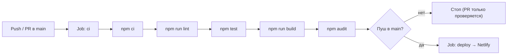

# HabitFlow — документация по интеграциям (ДЗ 6)

> Полное описание настройки CI/CD, OAuth2, аналитики, мониторинга и логирования.
> Стек: React + TypeScript + Vite + Supabase (BaaS).

## 0. Что было сделано и как использовался AI

| Шаг | Результат | Как помогал AI |
|-----|-----------|----------------|
| CI/CD | `.github/workflows/ci-cd.yml` | AI сгенерировал workflow GitHub Actions по описанию этапов (lint → test → build → audit → deploy), затем проверен и поправлен вручную. |
| Аудит безопасности | `security_audit.md`, `npm audit` | AI проанализировал код и схему БД по OWASP Top 10, дал рекомендации; вывод `npm audit` разобран автоматически. |
| OAuth2 (Google / Yandex ID) | `src/lib/oauth.ts`, кнопки в `LoginPage.tsx` | AI предложил Supabase Auth `signInWithOAuth` и написал функции `signInWithGoogle` + `signInWithYandex`. |
| Аналитика | `src/lib/analytics.ts` | AI сгенерировал обёртку над Яндекс.Метрикой и список событий-целей. |
| Логирование | `src/lib/logger.ts`, `002_logs.sql` | AI написал структурированный JSON-логгер и схему таблицы `app_logs`. |
| Мониторинг | `public/health.json`, `supabase/functions/health/` | AI предложил liveness + readiness (проверка БД) health-check. |

**Промпты, которые использовались (примеры):**
1. «Сгенерируй GitHub Actions workflow для React+Vite: install, lint, test, build, npm audit, деплой на Netlify при пуше в main».
2. «Проанализируй код HabitFlow на уязвимости OWASP Top 10 (XSS, CSRF, SQL Injection, утечка секретов) и дай список исправлений».
3. «Напиши функцию входа через Google OAuth2 на базе @supabase/supabase-js».
4. «Вот JSON-логи. Найди причину ошибки и предложи фикс» — тест AI-анализа логов (раздел 6).

---

## 1. CI/CD (GitHub Actions + Netlify)

### 1.1. Пайплайн `.github/workflows/ci-cd.yml`



**Этапы (job `ci`):** checkout → setup-node (Node 22) → `npm ci` → lint → test → build → `npm audit --audit-level=high`.
**Этапы (job `deploy`, только при пуше в `main`):** сборка с секретами → деплой `nwtgck/actions-netlify@v3` в `./dist`.

### 1.2. Секреты GitHub

Settings → Secrets and variables → Actions → New repository secret:

| Secret | Значение |
|--------|----------|
| `VITE_SUPABASE_URL` | Project URL из Supabase |
| `VITE_SUPABASE_ANON_KEY` | anon public key из Supabase |
| `NETLIFY_AUTH_TOKEN` | Netlify → User settings → Applications → New access token |
| `NETLIFY_SITE_ID` | Netlify → Site settings → General → Site ID |

### 1.3. Деплой на Netlify

`netlify.toml`: команда `npm run build`, публикация `dist`, `NODE_VERSION = 22`, SPA-redirect `/* → /index.html`.

---

## 2. Интеграция OAuth2 (Google — основной, Яндекс ID — опционально)

Реализовано в `src/lib/oauth.ts` через Supabase Auth `signInWithOAuth`.
В `LoginPage.tsx` две кнопки: «Продолжить с Google» и «Продолжить с Яндекс ID».

### 2.1. Google (встроенный провайдер Supabase)
1. Google Cloud Console → создать проект → **OAuth consent screen** (External).
2. **Credentials → Create Credentials → OAuth client ID → Web application**.
3. **Authorized redirect URIs**: `https://<project-ref>.supabase.co/auth/v1/callback`.
4. Скопировать **Client ID** и **Client secret**.
5. Supabase → **Authentication → Providers → Google** → включить, вставить ID/secret.

### 2.2. Яндекс ID (кастомный OIDC-провайдер Supabase)
> Supabase не имеет встроенного провайдера «Яндекс», поэтому Яндекс подключается
> как **Custom OIDC provider** с `Provider ID = yandex` (в коде `custom:yandex`).
1. https://oauth.yandex.ru → создать приложение (платформа **«Веб-сервисы»**).
2. **Redirect URI**: `https://<project-ref>.supabase.co/auth/v1/callback`.
3. Записать **ClientID** и **Client secret**.
4. Supabase → **Authentication → Providers → Add custom provider**:
   - Provider ID: `yandex`
   - вставить ClientID / Client secret.
   - Остальные поля (Issuer, Authorization/Token/UserInfo endpoints) Supabase заполнит по
     `.well-known/openid-configuration` Яндекса или вручную.

### 2.3. Код `src/lib/oauth.ts`
```ts
// Google — встроенный провайдер
export async function signInWithGoogle(): Promise<void> {
  const { error } = await supabase.auth.signInWithOAuth({
    provider: 'google',
    options: { redirectTo: window.location.origin },
  });
  if (error) throw new Error(error.message);
}

// Яндекс ID — кастомный OIDC
export async function signInWithYandex(): Promise<void> {
  const { error } = await supabase.auth.signInWithOAuth({
    provider: 'custom:yandex',
    options: { redirectTo: window.location.origin },
  });
  if (error) throw new Error(error.message);
}
```

### 2.4. Кнопки в `LoginPage.tsx`
```tsx
<button type="button" onClick={handleGoogleLogin}>Продолжить с Google</button>
<button type="button" onClick={handleYandexLogin}>Продолжить с Яндекс ID</button>
```

### 2.5. Тестирование
Вход → редирект на провайдера → возврат → сессия подхватывается в `App.tsx`
(`onAuthStateChange`). Ошибки логируются через `logger` и показываются в `catch`.
Оба провайдера должны направлять на один и тот же callback Supabase.

---

## 3. Интеграция аналитики (Яндекс.Метрика)

1. https://metrika.yandex.ru → «Добавить счётчик» → записать номер.
2. В `index.html` в `<head>` вставить скрипт счётчика (заменить `12345678`):
```html
<script type="text/javascript">
  (function(m,e,t,r,i,k,a){m[i]=m[i]||function(){(m[i].a=m[i].a||[]).push(arguments)};
  m[i].l=1*new Date();for(var j=0;j<document.scripts.length;j++){if(document.scripts[j].src===r){return;}}
  k=e.createElement(t),a=e.getElementsByTagName(t)[0],k.async=1,k.src=r,a.parentNode.insertBefore(k,a)})
  (window, document, "script", "https://mc.yandex.ru/metrika/tag.js", "ym");
  ym(12345678, "init", { clickmap:true, trackLinks:true, accurateTrackBounce:true });
</script>
```
3. В `.env`: `VITE_YM_COUNTER_ID=номер`.
4. События `analytics.habitCreated()`, `analytics.checkIn()`, `analytics.login()` и т.д. — вызвать в компонентах.

---

## 4. Платежи (опционально)

Требование ДЗ — **опционально**. Для минимальной сдачи достаточно **двух** сервисов (OAuth2 + аналитика). Если нужно: ЮKassa (РФ) / Stripe — backend создание платежа + webhook, frontend кнопка, тестовый режим.

---

## 5. Мониторинг

### 5.1. Liveness — `public/health.json`
`https://<site>.netlify.app/health.json` → `{"status":"ok",...}`.

### 5.2. Readiness + БД — Supabase Edge Function `supabase/functions/health/`
```bash
npx supabase login
npx supabase functions deploy health --project-ref <project-ref>
```
URL: `https://<project-ref>.supabase.co/functions/v1/health` → `200` или `503`.

### 5.3. Внешний монитор
UptimeRobot (бесплатный) → монитор на `health.json`, интервал 5 мин, алерт на email.

---

## 6. Логирование с AI-анализом

### 6.1. `src/lib/logger.ts`
JSON-логи, уровни `debug | info | warn | error`, минимальный уровень — `VITE_LOG_LEVEL`.
```ts
logger.info('habit_created', { id: 'h1', name: 'Чтение' });
logger.error('fetch_habits_failed', { code: '42501' });
```
Пример вывода:
```json
{"ts":"2026-10-03T19:00:00.000Z","level":"error","msg":"fetch_habits_failed","context":{"code":"42501"},"url":"https://site.netlify.app/"}
```

### 6.2. Централизованное хранение (опционально)
`002_logs.sql` → таблица `app_logs` + RLS.

### 6.3. AI-анализ логов (промпт)
```
Ты — DevOps-инженер. Проанализируй JSON-логи HabitFlow:
1) найди повторяющиеся ошибки и сгруппируй их;
2) определи вероятную причину каждой;
3) предложи конкретные исправления.
Логи: {...}
```

---

## 7. Проверка

| Проверка | Действие | Ожидание |
|----------|----------|----------|
| Линт | `npm run lint` | 0 ошибок |
| Тесты | `npm test` | 13 passed |
| Сборка | `npm run build` | dist собран |
| Аудит | `npm audit` | 0 уязвимостей |
| CI/CD | push в main | зелёный pipeline + деплой |
| OAuth2 | кнопки «Google» / «Яндекс ID» | вход работает |
| Аналитика | Метрика → реальное время | виден посетитель |
| Мониторинг | `/health.json` | `{"status":"ok"}` |
| Логи | консоль браузера | JSON-строки |
